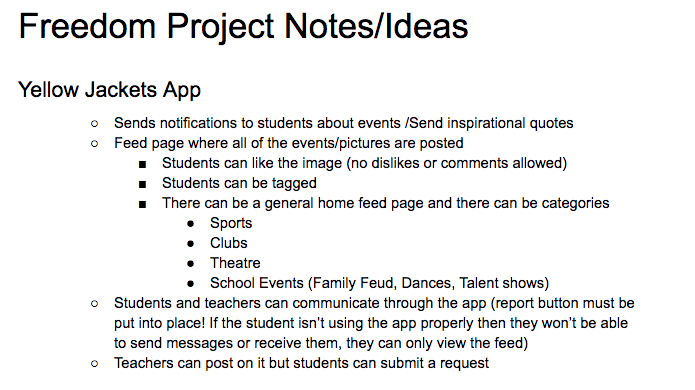
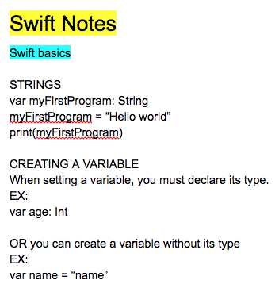

# Entry 3
##### 1/5/19

Me and my partner have commited to Swift, like it was stated in my last blog entry. We didn't finish working on the meal planner app since we were still a little unsure if Karla wanted to fully decide to be my partner. When we did decide that we were working together we started on a new mini project from scratch. It would be helpful for the both of us to work on something that was fresh for the both of us.
Karla and I have started working on a similar to the meal planner app. We found an [online book](https://www.hackingwithswift.com/quick-start/swiftui) that takes us through the steps using XCode on our laptops. We brought in our own personal laptops on days we would be working on the project since we know that it would't transer over if to our computers at home if we didn't.

###### Engineering Design Process

My partner and I are still in the planing phase. We want to be able to learn what Swift allows us to do so we can hopefully build it in the future. We have a couple of ideas written down already.
Here they are:

We are continuing to use the app code Swift to learn on our phones. We have been taking notes on what we learn so we would also have a reference guide in the future when making our project. 

[Previous](entry02.md) | [Next](entry04.md)

[Home](../README.md)