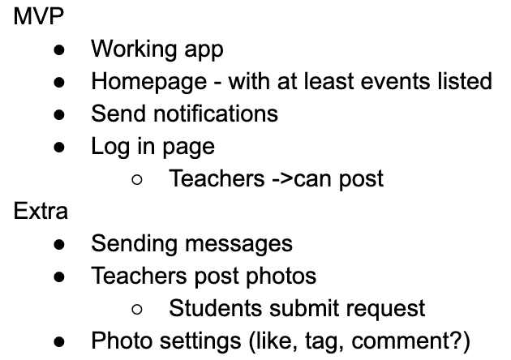
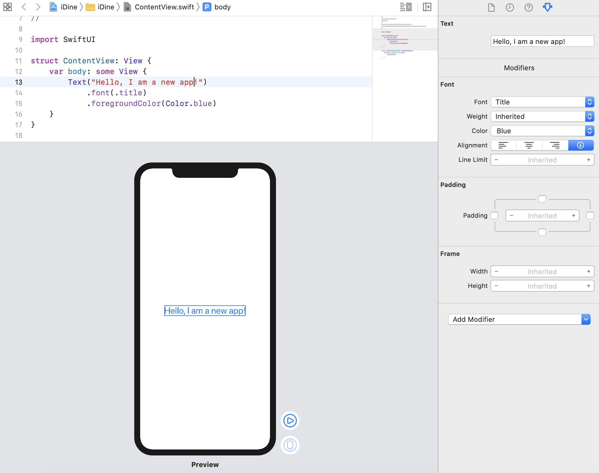
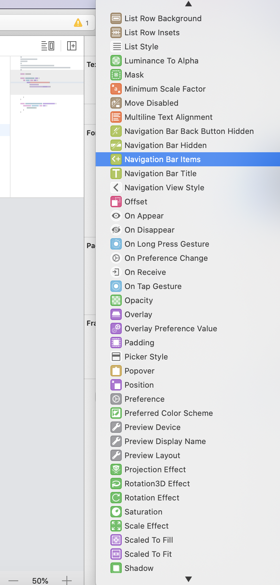

# Entry 4: Learning new components
##### 2/10/20

I was putting up the monthly school calendar on the Student Government bulletin board a few weeks ago when I thought, students get most of their information from their phones. Why not have all school events on one place on a student's phone? Like a Tele Kids App! 

My partner, Karla and I wrote down all of our ideas for the app but then realized we would need a MVP (minimum valuable product) before reaching to our highest expectations of the app. We came up with a short list that includes the following: 
 
We drafted this in a google docs where we right all of our ideas and what we have learned in Swift/Xcode. In this MVP we would like to make a log in page where teachers only can sign in to post events. Students will have no need to log in since they can't post, but will be able to receive notifications. We started doing some research to see how we would be able to make a log-in page, when we realized we would need firebase in order to hold all the log-in information. We realized this when we went onto a [templates page](https://www.iosapptemplates.com/mobiletemplates/free-swift-ios-app-templates-xcode) that had a few compontents that my partner and I would like to incorporate into our project. We also asked alummni that did a planner app and also used firebase. In order to use firebase one of us would have to learn firebase and the other person would have to learn Swift. That is how the alumni had done it the previous year. We plan on working on it together as we build the app. Firebase would also be needed in order to send out notifications. 
As for our extras list, we will also need firebase for many of these features as well. Expecially for sending messages through the app and/or submitting requests for post. In this case students would also need their own log-in. In order to make sure that these are tele students and not spam accounts we would require the log-in to use a hstat email. 

During our research and learning I have realized that Swift is similar to Java in some aspects. For example, 
<code>
if(condition){ 
}then code { 
else{ 
other code}</code> 
The else if statement in Swift would be the exact same as in Java. On a similar note, when creating a variable you must declare its type.
Example: <code>var age: Int</code> or you can create a variable without its type example:<code>var name = “name”</code> Meanwhile with java you would have to do <code> var int age = ___;</code> or <code>var int age;</code> My partner and I continue to use the CodeSwift app on our phones and videos on youtube to learn Swift. I personally like learning and then tinker, while my partner likes to tinker as we learn, and add into the IDine. I feel like that is a good building process, and I should start doing that as well. I guess I can do this by looking for things that I can incorporate in the app as we go. 

I have also noticed that there are a few things that Xcode can help you with without writing code yourself! I was tinkering around with the IDine app that my partner and I have been working on and found that when I clicked "Hello, I am a new app" there were features on the side. These features allowed me to change the font, size and color. 

It also had extra features that I could most definitely use later on for my app:

###### Summary:
I feel that my partner and I have finished up the planning phase in the Engineering Design Process, now that we have a clear idea of what our MVP should look like based on our knowledge of Swift and Firebase. We are now able to move forward into the create and test phase as we continue learning and building our prototype.

[Previous](entry03.md) | [Next](entry05.md)

[Home](../README.md)